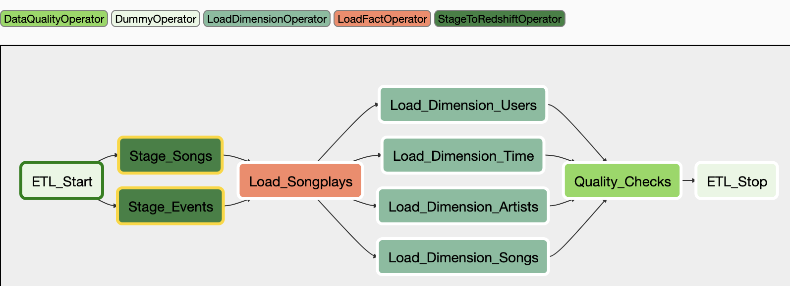

# Project: Data Pipelines with Airflow

## Project overview

A music streaming company, Sparkify, has decided that it is time to introduce more automation and monitoring to
their data warehouse ETL pipelines and come to the conclusion that the best tool to achieve this is Apache Airflow.

They have decided to bring you into the project and expect you to create high grade data pipelines that are dynamic
and built from reusable tasks, can be monitored, and allow easy backfills. They have also noted that the data quality
plays a big part when analyses are executed on top the data warehouse and want to run tests against their datasets after
the ETL steps have been executed to catch any discrepancies in the datasets.

The source data resides in S3 and needs to be processed in Sparkify's data warehouse in Amazon Redshift. 
The source datasets consist of JSON logs about user activity in the application and JSON metadata about the 
songs the users listen to.

## Running the project

### Prerequisites

- Apache Airflow service 
- Amazon Web Services credentials with S3 read permissions 
- Active AWS Redshift cluster 

### Apache Airflow

If you have an Apache Airflow environment running locally on your machine, you can of course drop the necessary DAG and
operator files from this repository into your Airflow directories. 

    Typical directory structure...
    ./dags                  # put your DAG files here.
    ./logs                  # logs from task execution and scheduler.
    ./plugins/operators     # put your custom operators here.

If you do not have a running Airflow environment, I would suggest running Airflow in a Docker container. Follow the
[**Docker Quick start**](https://airflow.apache.org/docs/apache-airflow/stable/start/docker.html) guidance to install
Docker and/or initialise an Airflow environment.

In short, After installing Docker desktop, download the Docker-Compose [**yaml**](https://airflow.apache.org/docs/apache-airflow/stable/docker-compose.yaml)
file to your project directory and initialise the environment by running the following commands via your terminal...

    airflow_project> docker-compose up airflow-init     # database migrations and set user account

    airflow_project> docker-compose up                  # start all services

Navigate your browser to **http://localhost:8080**, where you should be greeted with a log-in screen! 

## 'Create Redshift Tables' DAG overview

A simple execute as required DAG to establish the required staging, fact and dimension tables on the Redshift cluster.
A PostgresOperator executes an SQL file with DROP and CREATE TABLE statements.

## Main ETL DAG Overview

The DAG contains a default_args dictionary that sets the following rules:

- Does not have dependencies on past runs
- On failure, tasks are retried 3 times
- Retries happen every 5 minutes
- Catchup is turned off
- Does not email on retry

The DAG utilises 4 custom operators: 

- **StageToRedshiftOperator** 
  This staging operator loads JSON formatted files, app event logs and song metadata, stored in an S3 bucket to Redshift
  events and songs staging tables. S3 bucket keys, destination staging tables, and an SQL COPY statement are all 
  parameterised within the operator.
  

- **LoadFactOperator** 
This operator utilises an SQL helper class to load data from the staging tables to the destination fact table. The 
  destination table and SQL statement are both parameterised within the operator.
  

- **LoadDimensionOperator** 
This operator also utilises an SQL helper class to load data from the staging tables to the destination dimension 
  tables. The destination table and SQL statement are both parameterised within the operator.

- **DataQualityOperator** 
This operator runs checks on the fact and each dimension table to confirm the row count of each table against an 
  expected result. The DAG task holds a dictionary of tables to check and expected results for parsing to any of the 
  operator test cases.

*Working DAG with task dependencies set*

--- 
## Dataset
Two datasets are available for ingesting data into the Redshift Sparkify data warehouse.

    Song data: s3://udacity-dend/song_data
    Log data: s3://udacity-dend/log_data

### Song data
Song data resides in JSON format, with each file containing metadata about a specific song, and the song's artist. 
Within Sparkify's file storage, song files are partitioned by the first three letters of each song's track ID.

Filepath example...

    song_data/A/B/C/TRABCEI128F424C983.json
    song_data/A/A/B/TRAABJL12903CDCF1A.json

TRAABJL12903CDCF1A.json song file content...

    {
    "num_songs": 1,
    "artist_id": "ARJIE2Y1187B994AB7",
    "artist_latitude": null,
    "artist_longitude": null,
    "artist_location": "",
    "artist_name": "Line Renaud",
    "song_id": "SOUPIRU12A6D4FA1E1",
    "title": "Der Kleine Dompfaff",
    "duration": 152.92036,
    "year": 0
    }

###  Log data
User activity logs, collected via the Sparkify music streaming applications, also resides in JSON format. 
Each file represents a single day and contains information about each user and their session details for that day.
Within Sparkify's file storage, log files are partitioned by the month and year.

    log_data/2018/11/2018-11-12-events.json
    log_data/2018/11/2018-11-13-events.json

2018-11-12-events.json log file content...

    {
    "artist":null,
    "auth":"Logged In",
    "firstName":"Celeste",
    "gender":"F",
    "itemInSession":0,
    "lastName":"Williams",
    "length":null,
    "level":"free",
    "location":"Klamath Falls, OR",
    "method":"GET",
    "page":"Home",
    "registration":1541077528796.0,
    "sessionId":438,
    "song":null,
    "status":200,
    "ts":1541990217796,
    "userAgent":"\"Mozilla\/5.0 (Windows NT 6.1; WOW64) 
                AppleWebKit\/537.36 (KHTML, like Gecko) 
                Chrome\/37.0.2062.103 Safari\/537.36\"",
    "userId":"53"
    }

---

### Data Warehouse Table summary

**Table Name**  | **Description**
--------------- | ---------------
**staging_events** | Staging Table; Full data extraction from JSON event log files.
**staging_songs** | Staging Table; Full data extraction from JSON song files.
**songplays** | Fact Table;  Log data associated with song plays, filtered by user action 'Next Song'.
**users** | Dimension Table; Registered application users
**songs** | Dimension Table; Songs in music database
**artists** | Dimension Table; Artists in music database
**time** | Dimension Table; Timestamps of **songplays** records, broken down into specific units
